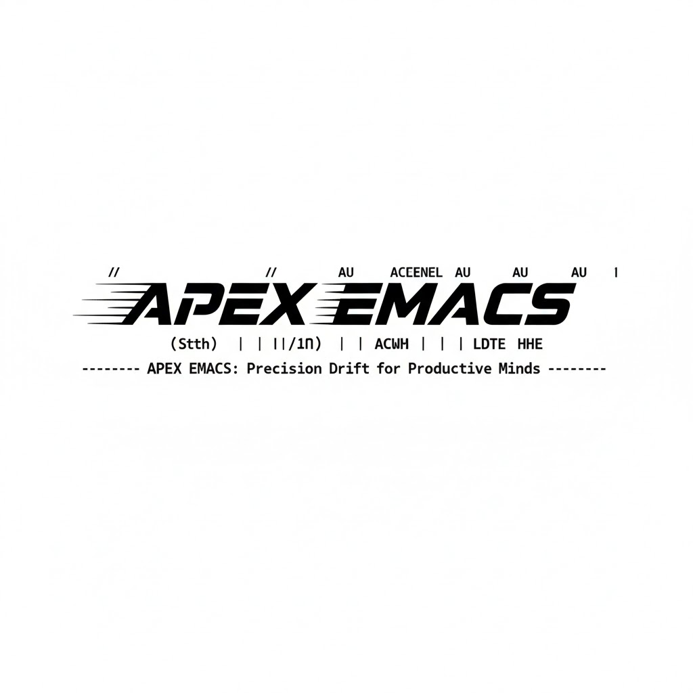

# 🚀 Emacs Custom IDE:  C/C++ IDE

## [English Version](./README.md) / [中文版本](./README.md)

This is a personalized Emacs configuration repository, designed to turn Emacs into an **out-of-the-box, efficient, and smooth all-purpose programming environment**. It is especially optimized for C/C++ development, balancing usability and powerful features, allowing you to get rid of tedious configurations and focus on coding itself.

### ✨ Core Features

#### 🧠 Intelligent Code Completion & Navigation (LSP Integration)

- Integrates **Language Server Protocol (LSP)** to provide industrial-grade code intelligence support.

- Supports **fuzzy matching code completion** for quickly filtering candidates and greatly improving coding efficiency.

- Full support for core features such as **go to definition, find references, rename, and code diagnostics**, comparable to mainstream IDEs.

#### 🔧 One-Stop C/C++ IDE Solution

- Custom-optimized C/C++ development workflow with **complete project management and efficient code navigation** capabilities.

- Built-in **debugging support**, seamlessly connecting to debugging tools for quickly locating code issues.

- Special optimization for C/C++ syntax highlighting, indentation, and formatting, complying with industrial coding standards.

#### 🚀 Built-in Multi-Language Code Snippets (YASnippet)

- Integrates YASnippet with preset common code templates for multiple mainstream programming languages.

- One-click insertion of code blocks (loops, conditionals, function definitions, comment templates, etc.) to reduce repetitive coding.

- Supports custom extended code snippets to adapt to personal coding habits and project requirements.

#### 📦 Easy Installation, Out-of-the-Box

- No complex environment configuration required; run Emacs directly after cloning.

- Compatible with Emacs 29+ native `use-package`; provides a simple supplementary installation solution for lower versions.

### 🛠 Quick Installation

#### 1. Clone the Configuration Repository

Clone the repository directly to the `~/.emacs.d` directory (overwrites existing configuration; back up important data in advance):

```bash
git clone https://github.com/jing6a70/emacs.git ~/.emacs.d
```

#### 2. Run Emacs

After cloning, start Emacs directly in the terminal or desktop environment:

```bash
emacs
```

#### 3. Compatibility for Older Emacs Versions (< 29)

Emacs 29 comes with the core dependency `use-package` natively. For versions below 29, manually install it after starting Emacs:

1. Press the shortcut `Alt + x` (to invoke the M-x command panel).

2. Enter the following command and press Enter, then wait for the installation to complete:

```elisp
package-install use-package
```

### 📂 Project Directory Structure

```plain
~/.emacs.d/
├── core/        # Core configuration files (initialization, global settings, etc.)
├── moduls/      # Independent configuration items for each plugin (on-demand loading, personalized settings)
├── elisp/       # Custom processing functions (extending Emacs native features)
└── snippets/    # Code snippet repository (YASnippet templates, multi-language support)
```

### 📝 Supplementary Notes

1. On the first startup, Emacs will automatically download and install required plugins; ensure network connectivity.

2. To modify C/C++ related configurations, check the corresponding LSP configuration files in the `moduls/` directory.

3. Custom code snippets can be directly placed in the corresponding language directory under `snippets/`; restart Emacs to take effect.

---

### ⭐If this configuration helps you, please give the repository a Star to show your support!

### ⭐⭐⭐ Thank you! ⭐⭐⭐
